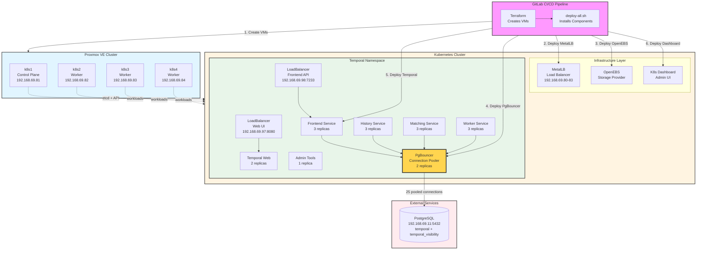

# Proxmox Kubernetes Infrastructure

This repository contains Terraform configurations and scripts to deploy a Kubernetes cluster on Proxmox VE, with integrated storage solutions and monitoring capabilities. For a detailed walkthrough of the setup process, see [this article](https://miketoscano.com/blog/?post=gitlab-terraform-proxmox-k8s).

## Architecture Overview



**Key Components:**
- **Infrastructure**: 4 VMs on Proxmox (1 control plane + 3 workers)
- **Load Balancing**: MetalLB provides external IPs (192.168.69.80-98)
- **Storage**: OpenEBS for persistent volumes
- **Temporal**: Distributed workflow engine with 16 pods
- **PgBouncer**: Connection pooler reducing DB connections from 90+ to ~50
- **PostgreSQL**: External database server (not managed by this repo)

## Features

- Automated Kubernetes cluster deployment on Proxmox VE
- OpenEBS storage integration for persistent volumes
- MetalLB for load balancing
- Temporal workflow engine deployment
- Monitoring stack with Prometheus and Grafana

## Getting Started

### Prerequisites

- Proxmox VE cluster
- Terraform 1.0.0 or later
- kubectl
- GitLab CI/CD (for automated deployment)

### Configuration

#### GitLab CI/CD Variables (Web UI)

These variables must be configured in your GitLab project settings (Settings > CI/CD > Variables):

- `GITLABACCESSTOKEN`: Access token for your GitLab user
- `GITLABUSERNAME`: Name of your GitLab user
- `PVEUSER`: Proxmox user for API authentication
- `PVEPASSWORD`: Proxmox password

#### Terraform Variables (terraform.tfvars)

Create a `terraform.tfvars` file in the root directory with these variables:

```hcl
# Proxmox Configuration - change as appropriate
pve_node     = "your-proxmox-node"
pve_storage  = "your-storage-name"
pve_template = "your-template-id"
pve_bridge   = "vmbr0"
pve_gateway  = "192.168.69.1"
pve_dns      = "192.168.69.1"
pve_domain   = "home"

# Kubernetes Node Configuration - change as appropriate
k8s_cpus          = 2
k8s_memory        = 4096
k8s_worker_cpus   = 4
k8s_worker_memory = 8192
k8s_disk_size     = 32
k8s_version       = "1.29.2"

# Kubernetes Network Configuration - change as appropriate
k8s_pod_cidr         = "10.244.0.0/16"
k8s_service_cidr     = "10.96.0.0/12"
k8s_dns_domain       = "cluster.local"
k8s_load_balancer_ip = "192.168.69.80"
k8s_load_balancer_range = "192.168.69.80-192.168.69.83"

# Node IP Addresses - change as appropriate
k8s1 = "192.168.69.81"  # Control Plane
k8s2 = "192.168.69.82"  # Worker 1
k8s3 = "192.168.69.83"  # Worker 2
k8s4 = "192.168.69.84"  # Worker 3
```

### Deployment

1. Configure the required variables in your GitLab project settings
2. Create and configure your `terraform.tfvars` file
3. Push your changes to the main branch or create a merge request
4. The pipeline will automatically:
   - Deploy the Kubernetes cluster
   - Configure MetalLB
   - Deploy a sample NGINX server
   - Configure OpenEBS storage
   - Deploy Temporal with monitoring

## Maintenance

### Recovering After Host Reboot

After a Proxmox host restart, Kubernetes pods may show "Unknown" status. To automatically clean up and recover:

```bash
# Quick recovery script
./scripts/cleanup-unknown-pods.sh

# Or manually:
kubectl get pods -A --field-selector status.phase=Unknown
kubectl delete pods -A --field-selector status.phase=Unknown --force --grace-period=0
```

The cluster will automatically recreate the pods. Allow 1-2 minutes for all services to stabilize.

### Preventing Pod Recovery Issues

To ensure smooth recovery after reboots:

1. **Enable automatic kubelet restart** (already configured on your nodes):
   ```bash
   sudo systemctl enable kubelet
   sudo systemctl enable containerd
   ```

2. **Configure pod disruption budgets** for critical services:
   ```yaml
   apiVersion: policy/v1
   kind: PodDisruptionBudget
   metadata:
     name: temporal-frontend-pdb
     namespace: temporal
   spec:
     minAvailable: 2
     selector:
       matchLabels:
         app.kubernetes.io/component: frontend
   ```

3. **Monitor cluster health** after reboots:
   ```bash
   kubectl get nodes
   kubectl get pods -A
   ```

### PostgreSQL Performance Tuning for Temporal

Temporal creates many database connections which can overwhelm PostgreSQL. This infrastructure automatically deploys PgBouncer to prevent database connection exhaustion.

#### Architecture

**PgBouncer (Automatically Deployed)**:
- Connection pooler sitting between Temporal and PostgreSQL
- Reduces idle connections from 90+ to ~50
- Configured in transaction pooling mode for optimal performance
- All Temporal services automatically use `pgbouncer.temporal.svc.cluster.local:5432`

#### Problem Symptoms (If PgBouncer Fails)
- Workflow list loads but details timeout
- History service logs show "context deadline exceeded"
- Database has many idle connections (90+ out of 250 max)

#### Verifying PgBouncer

```bash
# Check PgBouncer status
kubectl get pods -n temporal -l app=pgbouncer

# View connection statistics
kubectl logs -n temporal -l app=pgbouncer --tail=20 | grep "stats:"

# Check idle connection reduction
./scripts/check-postgres-from-cluster.sh
```

#### Additional PostgreSQL Tuning (Optional)

If you still experience issues or want to optimize further, tune the PostgreSQL server directly:

On the PostgreSQL server (192.168.69.11):

```bash
# Copy the tuning script
scp scripts/tune-postgres-for-temporal.sh 192.168.69.11:/tmp/

# SSH to the database server and run
ssh 192.168.69.11
sudo /tmp/tune-postgres-for-temporal.sh

# Apply recommended settings (review first!)
sudo cat /tmp/pg_temporal_tuning.conf >> /etc/postgresql/*/main/postgresql.conf
sudo systemctl restart postgresql
```

Key settings adjusted:
- **max_connections**: 250 (already set)
- **shared_buffers**: 25% of system RAM
- **work_mem**: 16MB (for complex queries)
- **autovacuum**: Aggressive settings for high write volume
- **idle_in_transaction_session_timeout**: 5 minutes (prevents hung connections)

#### Monitoring Database Health

```bash
# Check database health and connection usage
./scripts/check-postgres-health.sh

# From within the cluster
kubectl exec -n temporal temporal-admintools-<pod> -- \
  sh -c 'PGPASSWORD=postgres psql -h 192.168.69.11 -U postgres -d postgres -c "SELECT state, count(*) FROM pg_stat_activity GROUP BY state;"'
```

#### Connection Pool Sizing

With PgBouncer, each Temporal service needs:
- Frontend: ~5-10 connections per replica
- History: ~10-15 connections per replica  
- Matching: ~5-10 connections per replica
- Worker: ~5-10 connections per replica

Total needed: ~100-150 connections, pooled from 1000+ client connections.
```
